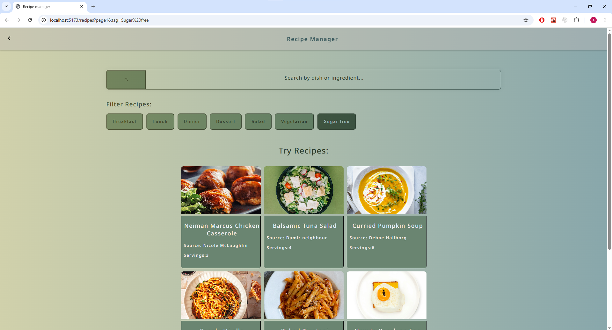

# Recipe Manager

## Introduction

Recipe manager app built with **React.js frontend** and **Node.js/Express backend**, connected to **MongoDB** for data storage and **Cloudinary** for image hosting.
Also includes CRUD operations, search, filtering and pagination.

## App Screenshot

### Recipe List (filtered)



## Features

- Browse and manage recipes
- Add ingredients with quantities and units
- Categorize recipes with tags (Breakfast, Lunch, Dinner, Dessert, Salad, Vegetarian, Sugar Free)
- Upload images to Cloudinary
- MongoDB seed script to populate sample data

## Project Structure

```
RecipeManager/
├── backend/ # Node.js + Express + MongoDB API
│ ├── models/
│ ├── routes/
│ ├── data/ # Seed recipes
│ ├── app.js
│ ├── seed.js
│ └── .env.example
├── frontend/ # React.js (Vite) client
│ ├── public/
│ ├── src/
│ │ ├── components/
│ │ ├── store/
│ │ ├── UI/
│ │ ├── utils/
│ │ ├── App.jsx
│ │ ├── http.js
│ │ ├── index.css
│ │ └── main.jsx
│ ├── eslint.config.js
│ ├── index.html
│ └── .gitignore
└── README.md
```

## Installation & Setup

### 1. Clone the repository

```bash
git clone https://github.com/ante-debelic/recipe-manager.git
cd recipe-manager
```

### Backend setup

cd backend
npm install

Create a .env file in the backend/ directory based on .env.example:

MONGODB_URI=your-mongodb-uri
CLOUDINARY_CLOUD_NAME=your-cloud-name
CLOUDINARY_API_KEY=your-api-key
CLOUDINARY_API_SECRET=your-api-secret
PORT=3000

Run the backend server:

npm start

Seed the database with sample recipes:

npm seed

### Frontend setup

cd ../frontend
npm install
npm start

The frontend will start at:
http://localhost:5173

The backend runs at:
http://localhost:3000

### Available Scripts

Backend
npm start – run backend with nodemon
npm seed – seed MongoDB with sample data

Frontend
npm start - run frontend(Vite)
npm run build - build frontend for production

### Dependencies section

## Tech Stack

**Frontend:**

- React.js (Vite)
- react-dom
- react-router
- react-icons
- Fetch API

**Backend:**

- Node.js + Express
- MongoDB + Mongoose
- Multer
- Cloudinary (image storage)

**Other:**

- dotenv (for environment variables)
